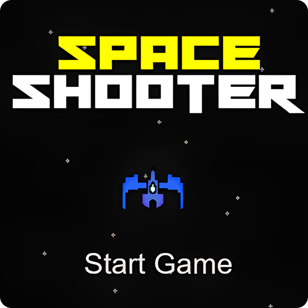

# 🚀 Space Shooter Game Using Raylib
This is a fun and exciting 2D Space Shooter Game developed using the Raylib library in C++. Players control a spaceship, navigating through space while dodging obstacles and shooting enemies to score points.

# Features:
- Smooth spaceship controls
- Dynamic enemy movement and firing
- Real-time score tracking
- Fun retro-style space theme with custom textures

# Tech Stack:
- Language: C++
- Graphics: Raylib library
- Platform: Cross-platform (Windows, Linux, MacOS)

Used Webassembly, So That Players Can Play Online On Web.
Feel free to check out the code and contribute!

